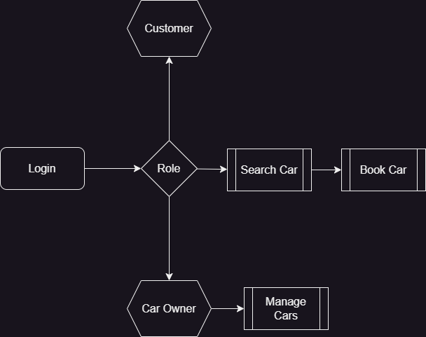
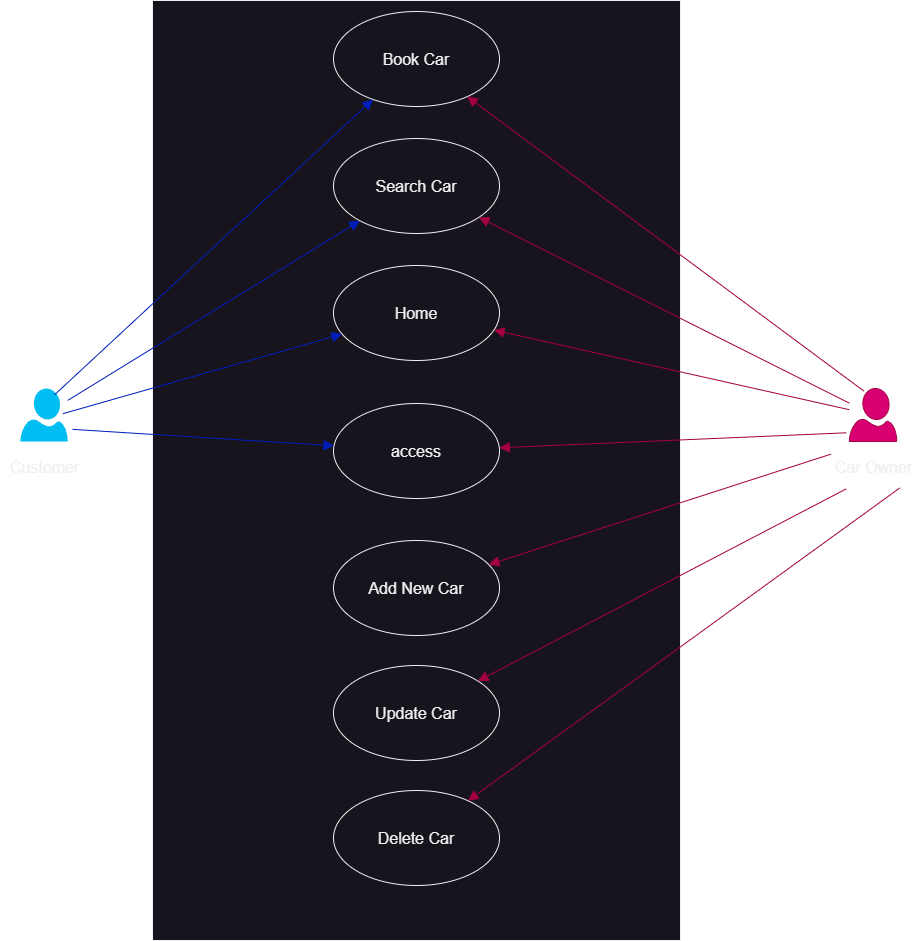
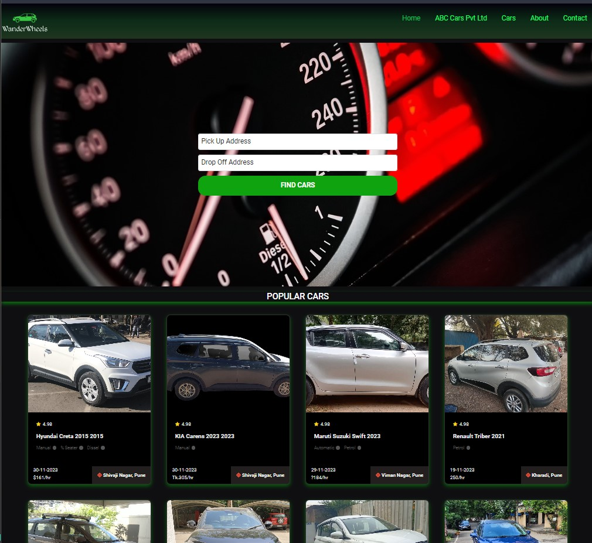
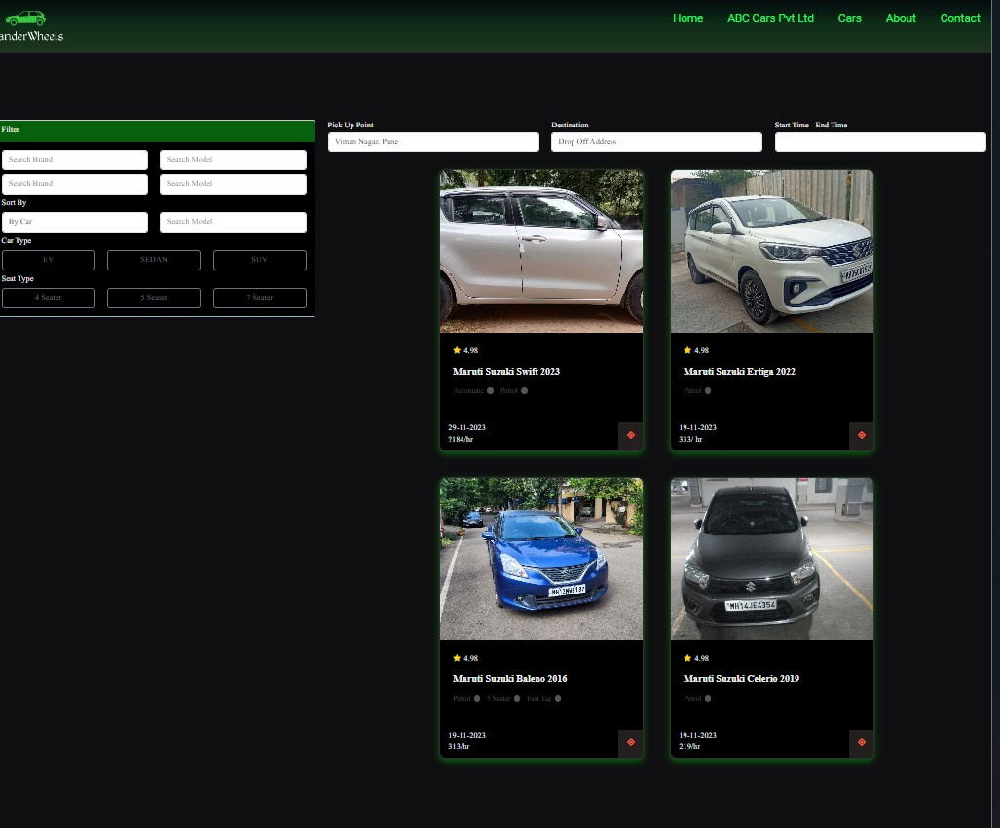
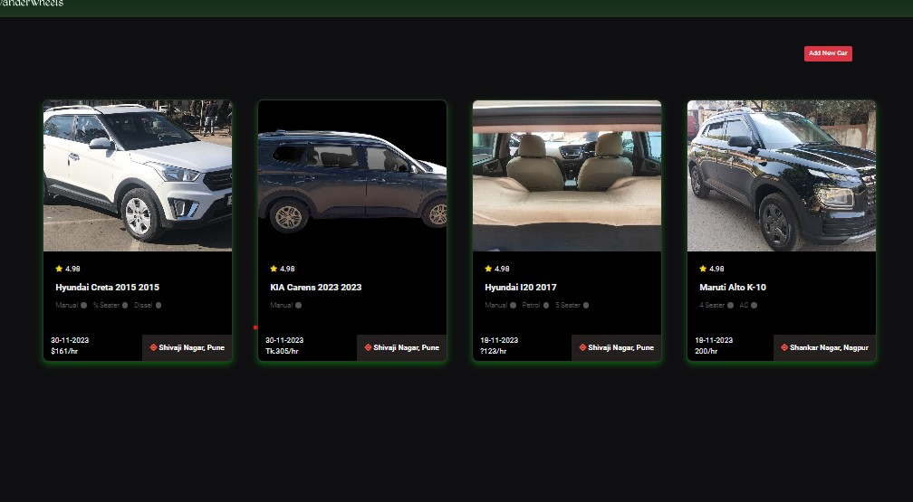
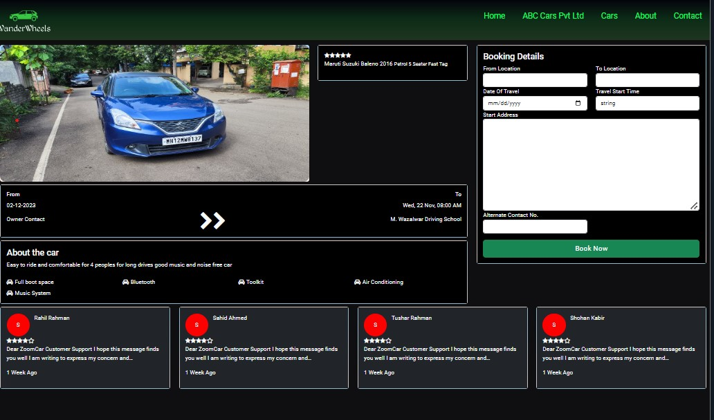
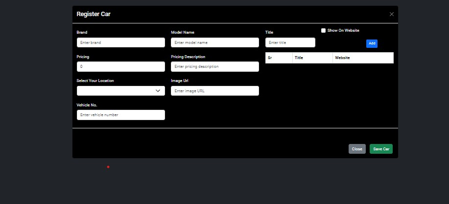

# WanderWheels

WanderWheels is a Car rental System provides a convenient, on-demand solution for short-term vehicle access

[WanderWheels Live Site](https://ho-ssain.github.io/WanderWheels/)

## User Role

1. Customer
2. Car Owner

## Features

1. cars by Owner-id
2. cars by location
3. search car by location
4. add new car
5. access
6. create booking

## System Design



## Use Case



## UI







## Technologies Used

- Angular
- API Used [https://freeapi.miniprojectideas.com/index.html]

## Installation

```bash
git clone https://github.com/ho-ssain/WanderWheels.git
cd your-project
npm install
```

## Usage

```bash
ng serve
```

(inspired by zoomcar)
